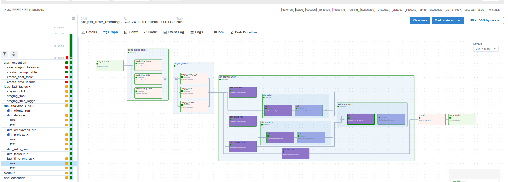
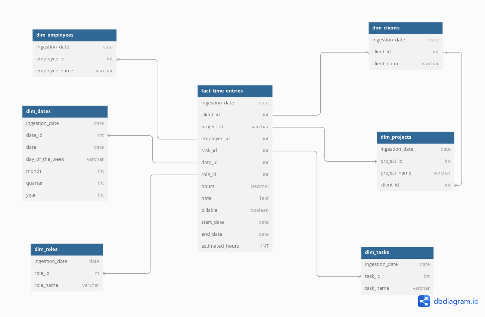

Overview
========

This project uses Astro run time to run and manage Airflow instance

### Pipeline execution 


### Entity relationship diagram design


How to setup this project
================
- Clone this project

- To initialize and setup the project run the below command. This command will check if your system has astro-cli installed, if not found it will be automatically installed. Once done run the below command to bring up all required instances to run Airflow UI

```shell
make setup
```

- Once the the setup is completed run the below command. This will launch Airflow instance on the system default browser

```shell
make start
```

- To shut down all running processes run

```shell
make clean
```

- To see more command options run

```shell
make help
```

- To run pytest with the below comand.

```shell
make test
```

Troubleshoot common issues
================

- At boot, Airflow tunnels to default port 8080 and postgres to port 5432. Ensure there is no process running on these ports on your system, else airflow setup won't succeed. Ensure these PID processes are killed before initiating the setup-command.


Configurations
====================

The following configuration should be in place for this project to run successfully

- Ensure the sample_credential.json file is imported via the Airflow UI. This is to demonstrate privacy and not exposing secrets and sensitive data publicly
- Also create dbt connection id in the Airflow UI and fill up all the connection details using environment variables from the `sample_credentials.json` that connects to Airflow metastore.


    